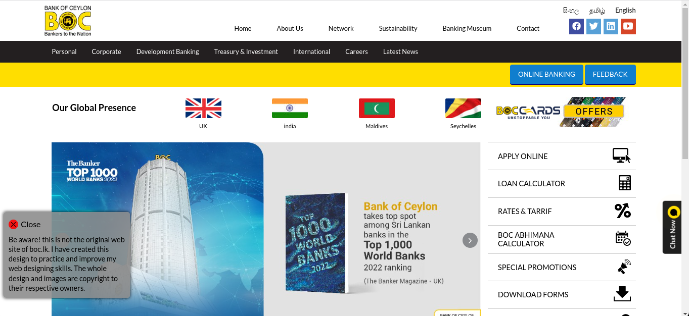
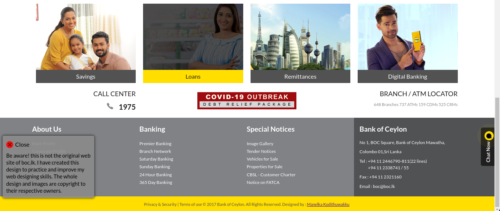

<h1 align="center">
  <br>
    BOC Clone
  <br>
</h1>

<h4 align="center">
   This is a clone website of Bank of Ceylon (BOC) of Sri Lanka. The whole design, layouts, and images are copyright to their respective owners <a href="https://www.boc.lk/">boc.lk</a>.
  I have created this design to practice and improve my web designing skills. 
</h4>

<p align="center">
  • <a href="#sample-images-">Sample images</a> •
  <a href="#built-with-">Built with</a> •
  <a href="#how-to-use-this-repo">How to use this repo?</a> •
  <a href="#contact">Contact</a> •
</p>

---

## Sample Images :


<br>
---



---
## Built With :

[](https://html.spec.whatwg.org/)

#### HTML5 :

- Semantic Elements
- Images


[](https://developer.mozilla.org/en-US/docs/Web/CSS)

#### CSS3 :

- Transform Function
- Transition
- CalC
- Shadow
- Scroll Snapping
- Animations

> **Note**
> This site does not use any media queries, so this site is not a responsive web page.

---

## How to use this repo?

```bash
# Open the terminal 

# Clone this repository
$ git clone https://github.com/Direct-Entry-Program9/boc-clone.git

# Install dependencies
$ npm install

# Run the app
$ npx serve
```

---

## Contact

> GitHub [@Manelka Kodithuwakku](https://github.com/ManelkaKodithuwakku) &nbsp;&middot;&nbsp;
> 
> Linkedin [@Manelka Kodithuwakku](https://www.linkedin.com/in/manelka-kodithuwakku/)